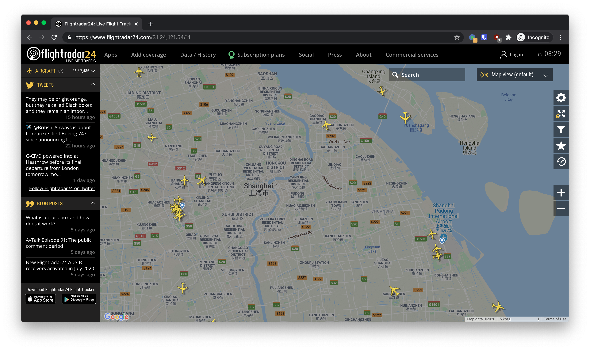
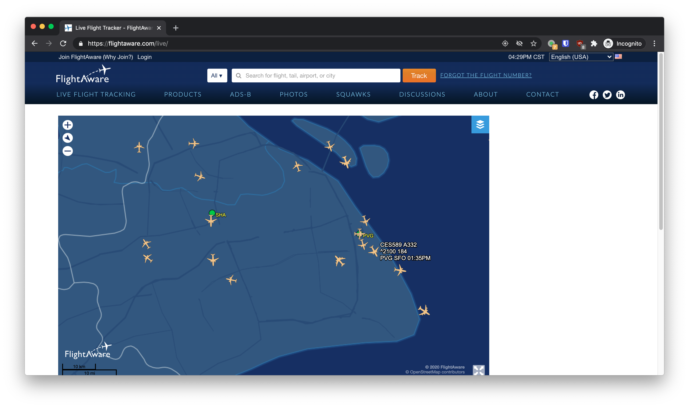

# SI 100B Project: Who is Flying over? - Week 1

* **Code and Report Due**: 10:00 am, December 11th, 2020, China Standard Time 
* **Face to Face Check**: From 10:15 am, December 11th, 2020, China Standard Time at SIST 1A-109

In this week, we are finishing the very first yet important task in this project - getting reliable flight information. We are getting the data from websites that provide real-time flight data feed by writing a crawler (网络爬虫程序). What those websites do is distributing the radio receivers across the world in a crowd-sourcing way to pick up the ADB-S signal and distribute the data via the Internet. The most widely used websites of this kind are FlightRadar24 (https://www.flightradar24.com/) and FlightAware (https://flightaware.com/live/ ). 

## The Data Source

The first step for writing a web crawler is to determine what requests you want to send and how you will parse the response from the server. Generally, each website has a slightly different schema of request and response and you will need to explore the patterns in request and response. However, since almost all those requests and responses are using HTTP, the underlying principle is the same.

In this section, you are going to explore the schema of requests and responses of **any one** of FlightRadar24 or FlightWare. The techniques required to crawl the two websites are almost the same, and the difficulty is similar. You can choose any one of them. Some people may encounter some connectivity issue with one of those two; in this case, just switch to the other.

Many well-written Python packages can help you to send requests to an HTTP server and get responses. A package called `requests`, which could be installed with PyPI, is recommended for this project. Some other packages, like `urllib3`, provide the same functionality but is more complicated to use. Before you start, you need to understand how to use your tools. Read the documentation of [`requests`](https://requests.readthedocs.io/en/master/) or any other HTTP client library you choose to use, and answer the following questions:

*  How to send an HTTP `GET` request to a URL, for example, the home page of ShanghaiTech?  You can also use other smaller websites to get started, for example, the [pwd man page](http://linuxcommand.sourceforge.net/lc3_man_pages/pwdh.html).
* Which format of URL does the package accept? Is `https://www.shanghaitech.edu.cn/` a legal URL? How about `sist.shanghaitech.edu.cn`?
* How to determine if the request is successful? For example, what is the status code you get from requesting `https://httpbin.org/status/400`? Is it a status code indicating a successful processed request?
* How to get the response body for a request? For example, how will you get the content of `https://tools.ietf.org/rfc/rfc2616.txt` with your tool in Python?

Prepare to explain your answers to a TA.

### FlightRadar24



Follow this section if you choose to crawl FlightRadar24 for data. Jump to next section if you are using FlightAware.

Now, open FlightRadar24 (linked above) in your browser (a current version of Chrome, Firefox, Safari and Edges is highly recommended) and open the developer tool of your browser (If you use Chrome, press `Control+Shift+I`). Wait until the site is fully loaded and starts to display the location of airplanes, and then go to the `network` tab of your developer tools. Explore the requests your browser sent out and the response from the server. Determine which part of the requests is related to the dynamic updating of the page to show the up-to-date list of airplanes in a certain area. Then do the following things:

- Write down the URL of the requests and take a guess of what each part of the parameters means;
- Determine what method is used for each request;
- Determine the format of the response and find a way to parse it to a structured one that Python could understand;
- Determine the meaning of each field of the response. You can do this by comparing the response with the displayed values on the web page.

Write a simple program to verify your guess in this section and prepare to explain your answers and program to a TA.

**Hint**: you are requesting https://data-live.flightradar24.com/zones/fcgi/feed.js for the flight data. One example request is to https://data-live.flightradar24.com/zones/fcgi/feed.js?bounds=31.53,30.90,120.91,122.17&faa=1&satellite=1&mlat=1&flarm=1&adsb=1&gnd=1&air=1&vehicles=1&estimated=1&maxage=14400&gliders=1&stats=1. Explore what does each parameter mean so that you can get some clues about how to generate your own request in next section.

### FlightAware



Follow this section is you choose to crawl FlightAware for your data.

Now, open FlightAware (linked above) in your browser (a current version of Chrome, Firefox, Safari and Edges is highly recommended) and open the developer tool of your browser(If you use Chrome, press `Control+Shift+I`). Wait until the site is fully loaded and starts to display the location of airplanes, and then go to the `network` tab of your developer tools. Explore the requests your browser sent out and response from the server. Determine which part of the requests is related to the dynamic updating of the page to show the up-to-date list of airplanes in a certain area. Then do the following things:

- Write down the URL of the requests and take a guess of what each part of the parameters means;
- Determine what method is used for each request;
- Determine the format of the response and find a way to parse it to a structured one that Python could understand;
- Determine the meaning of each field of the response. You can do this by comparing the response with the displayed values on the web page or take a guess of the meaning of the tags in the response from the server.

Write a simple program to verify your guess in this section and prepare to explain your answers and program to a TA.

**Hint**: You are requesting https://flightaware.com/ajax/vicinity_aircraft.rvt for the flight data. A possible request is to https://flightaware.com/ajax/vicinity_aircraft.rvt?&minLon=109.0283203125&minLat=-8.59954833984375&maxLon=180&maxLat=27.0703125&token=e70b744ef39ffcbc8e52cb8caa9619e55ced9bb1. Explore what does each parameter mean so that you can get some clues about how to generate your own request in next section. If your program simply request this URL, you will sometimes get no data and a HTTP 400 or 500 status code indicating an error. This probably means your token (i.e., the `token` parameter in the request. In the example above, it is `e70b744ef39ffcbc8e52cb8caa9619e55ced9bb1`) has expired and needs you to update it.

There are two ways to update the token. The first one is easier. You open a new browser tab and load the FlightAware website. Then you can copy down the newly generated token from the dev tool and paste it to your script. The down side of the method is that you need to do it for every few hours before your token gets expired. Another method is to find the request where the token is responded from the server and request the URL periodically to update it. This method requires some advanced understanding of web development.

## Implement your Crawler

Now that you have some idea of what requests you need to send to get the list of airplanes in a certain area, the next step is to implement the crawler. Now implement the crawler in the `Fr24Crawler` class in `data_source/fr24_crawler.py`. Your implementation should follow the following specifications:

- `__init__(self, loc, rng)`: `loc` is a tuple of two `float`-typed numbers indicating the coordinates of the place you want to get flight information about. The first item in `loc` (i.e., `loc[0]`) is the latitude of the place and the second item is the longitude of the place. `rng` is a `float`-typed number in nautical miles (nm, 海里). You should include all the airplanes within `rng` nautical miles from the place. In this method, initialize your crawler with those parameters.

- `get_data_once(self)`: This method should send a batch of requests, parse the results and return all the airplane information within `rng` nm of the place at `loc` at the moment and store them in a temporary file (for further use in following tasks). You are free to design your own data type for storing as long as it contains all of the following information of every airplane:

  - The longitude and the latitude (经纬度) of the airplane;
  - The heading (航向) of the airplane;
  - The altitude (海拔高度) of the airplane;
  - The ground speed (地速), the speed of the airplane related to the ground;
  - The squawk number (应答机编号), registration number (国籍注册号) and flight number (航班号) of the flight;
  - The departure airport and the arrival airport’s IATA code of the airplane.

  Notice that you are required to store the information you get from FlightRadar24 to a temporary file, a common practice on Linux is to store it under `/tmp`. You should give the temporary file with a suitable name so that you can find it easily in the future. Before you store the file, you may need to serialize the data with some format like JSON.
  
  **Hint**: You may need to come up with a way to convert the central coordinate and range representation in this project to one that the API of FlightRadar24 or FlightAware could understand before sending it to the server. This involves some geometry on the sphere. However, your conversion could be an approximate one.

- `spin(interval=1)`: Run `get_data_once(self)` every `interval` seconds.

Write a simple program to get the above information with all the information within 20nm to someone on campus of ShanghaiTech(lat: 31.17940, lon: 121.59043) with your crawler every 10 seconds and display the result in a proper way. Be prepared to explain how the program works to the TAs.

## Submission

You need to submit a report on how you design your web crawler, including what tools you used, what requests you sent to the server and how you parse the result from the server and also your code.

Submit your report as a PDF file to Gradescope. Submit your implementation code to GitLab by creating a tag as followed. Attend the face to face check at SIST 1A-109.

First, make a commit from your files. From the root folder of this repository, run

```shell
git add .
git commit -m '{your commit message}'
```

Then add a tag to create a submission.

```shell
git tag {tagname} && git push origin {tagname}
```

You need to define your own submission tag by changing `{tagname}`, e.g.

```shell
git tag first_trial && git push origin first_trial
```

**Please use a new tag for every new submission.**

Every submission will create a new GitLab issue, where you can track the progress.